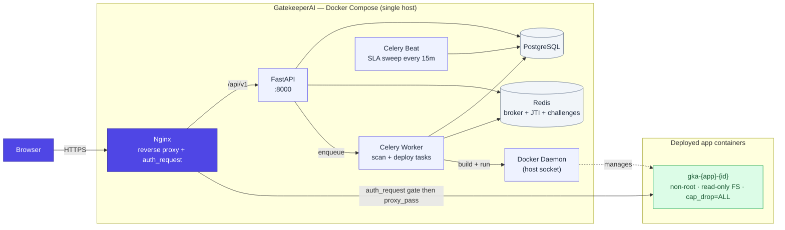
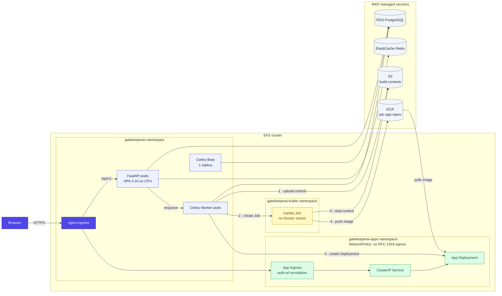

# Design Decisions

A summary of the key choices behind GatekeeperAI's architecture — what I picked, what I traded away, and where the design starts to crack under pressure.

---

## Architecture diagrams

Both deployment backends run the same application code behind the same `DEPLOY_BACKEND` switch — the diagrams below show how the request path and the deploy path differ between them.

### Docker Compose deployment

**Read on this:** everything — platform and every tenant app — runs as a container on one host. The worker holds the Docker socket, so it can build and run tenant images directly; that convenience is also the sharpest security edge on this path (see [Tradeoffs I made knowingly](#tradeoffs-i-made-knowingly)). Nginx is the only thing standing between the internet and a deployed app; it calls back into the API's `auth_request` endpoint on every single request before proxying through.

### Kubernetes / EKS deployment

**Read on this:** the platform and every tenant app now run in different namespaces with different blast radii. Kaniko builds images with no Docker socket and no daemon access at all — the numbered edges above are the actual build sequence (S3 upload → Kaniko Job → Kaniko reads S3 → pushes to ECR → worker creates the K8s Deployment → the pod pulls from ECR). RDS, ElastiCache, S3, and ECR are managed AWS services instead of containers on the same host, which is what lets the platform and the tenant apps scale independently of each other.

---

## How it works

The short version, no jargon:

1. **A developer submits an app.** Either a ZIP upload through the browser, or a `git push` to GatekeeperAI's built-in git server. Either way, the code lands in a bare git repository and the exact commit is recorded.
2. **Five automated scanners run at once** — checking for hardcoded secrets, vulnerable dependencies, unexpected outbound network calls, exposed personal data, and (via Claude) anything that looks unsafe about how the app handles AI-specific risk. This takes seconds to about a minute, and the developer watches it happen live.
3. **The scan produces a risk tier** — green, yellow, or red — and lands in a human reviewer's queue with a deadline attached. No app skips this step; nothing deploys on a scan result alone.
4. **A reviewer approves or rejects it.** Rejections go back to the developer with feedback. Approval kicks off the deploy automatically.
5. **The app is built and started in an isolated container** — non-root, read-only filesystem, dropped Linux capabilities, hard CPU/memory limits. On Docker Compose this is a `docker build` on the same host; on Kubernetes it's a Kaniko build job that pushes to ECR and a Deployment that pulls from it. Either way, the app never gets broader access than that sandbox.
6. **The app gets a stable, access-gated URL.** Every request to it is checked against the platform's auth before the app ever sees the request — the app itself doesn't need to implement login, sessions, or permissions.
7. **Everything is logged.** Every submission, scan, approval, deployment, and secret change is written to an append-only audit log, queryable by an admin and forwardable to a SIEM.

That loop — submit, scan, approve, sandbox, gate, log — is the whole product. The two deployment backends above are two different ways of executing steps 5 and 6; the governance model (steps 1–4 and 7) is identical either way.

---

## Why this stack

**FastAPI over Django or Flask**
The core constraint was a streaming scan pipeline. Scans run five checks in parallel and stream results to the browser via Server-Sent Events as each check completes. FastAPI's async-first model handles this naturally — Django's ORM and request lifecycle fight it. Flask could work but you end up bolting on async support that wasn't designed in. FastAPI also generates OpenAPI docs automatically, which matters when you're building a platform that other developers integrate with.

**SQLAlchemy 2.0 async + PostgreSQL**
I needed two things the alternatives don't give cleanly: JSONB columns for scan findings (structured but schema-flexible across scanner types) and UUID arrays for per-app access control (`allowed_users UUID[]`). PostgreSQL handles both natively. SQLAlchemy 2.0's async session model pairs well with FastAPI — one `AsyncSession` per request, injected as a dependency, closed automatically. The tradeoff is verbosity: async SQLAlchemy is more ceremonial than a lightweight ORM like Tortoise, but the explicitness is worth it when you're dealing with concurrent scan and deploy tasks touching the same rows.

**Celery + Redis for task execution**
Scans take 15–60 seconds. Deploys involve a `docker build`, which can take several minutes. Neither belongs in the request/response cycle. Celery gives task isolation, retry logic, and a clean boundary between the API and the work — the API enqueues, the worker executes, the result lands in the database. Redis was already required for JWT refresh token JTI tracking, so using it as the Celery broker and result backend costs nothing architecturally. The three-process model (API, worker, beat) adds local dev friction but is the right separation — beat handles SLA checks on a cron without touching the worker's task queue.

**Docker SDK (Python) over shell exec**
`subprocess.run(["docker", "build", ...])` is the obvious first move, but it couples you to the Docker CLI binary, makes error handling messy, and is a pain to test. The Python Docker SDK gives a proper object model — containers, images, logs — and makes it straightforward to check `container.status`, stream logs, and catch `NotFound` exceptions when a container disappears between calls.

**nginx auth_request for per-app access control**
Every request to a deployed app passes through nginx before it reaches the container. Rather than requiring each app to implement its own auth (which apps built by non-engineers won't do correctly), nginx's `auth_request` directive calls a GatekeeperAI endpoint before proxying. If the response is 2xx the request goes through; otherwise nginx returns 401 or 403. The deployed app never sees unauthenticated traffic. The tradeoff is that every request to a deployed app makes a subrequest to the GatekeeperAI API — a performance cost that's acceptable at small scale but would need caching at high load.

**Passkeys as the default sign-in method**
Passkeys are phishing-proof by construction (the credential is bound to the origin), and Touch ID / Face ID are faster than any password flow. The WebAuthn spec is mature enough that `@simplewebauthn/server` and `@simplewebauthn/browser` cover the complexity. Password auth stays available as a fallback for devices that don't support platform authenticators. I'd rather default to the secure path and fall back than default to passwords and offer passkeys as an opt-in that nobody enables.

**SSO / OIDC as the enterprise on-ramp**
Passkeys are the right default for individuals, but enterprise procurement requires SSO — "we already manage identities in Okta, we're not maintaining a second directory." The implementation uses `authlib` for the OIDC Authorization Code Flow with PKCE. Discovery document caching in Redis (1-hour TTL, invalidated on config update) avoids a round-trip on every login without letting stale metadata sit forever.

The callback-to-frontend token handoff is the least obvious part: the OIDC callback is a browser redirect (GET), so you can't return JSON tokens directly. The solution is a short-lived exchange code stored in Redis (UUID key, 120-second TTL, consumed via GETDEL). The IdP redirects the browser to `/login?sso_code={uuid}`, the frontend POSTs that code to `/auth/sso/exchange`, and the exchange returns normal access + refresh tokens. Single-use and time-limited — if the browser never completes the exchange, the code expires harmlessly.

Group-to-role mapping uses a priority dict (`admin:3 > approver:2 > ic:1`) so users who belong to multiple groups always get their highest entitled role. Groups are written back to `users.sso_groups` on every login, which means the nginx `auth_request` endpoint for per-app group access always reflects current IdP state without an extra IdP call at request time.

One deliberate constraint: local admin accounts (those with a `hashed_password`) are never demoted by SSO role mappings. An IdP misconfiguration that returns no groups or the wrong groups for the setup admin cannot lock the operator out of their own instance.

---

## The LLM scanner — where it helps and where it doesn't

The fifth scanner sends the submitted code to Claude for a code review focused on security and AI-specific risks (prompt injection, model output handling, PII exposure patterns, unusual outbound connections). It's the only scanner that can reason about *intent* rather than just matching patterns.

**Where it's useful:** Catching things the static scanners can't — a function that looks structurally fine but is clearly logging user inputs to an external API, or a Streamlit app that renders LLM output as raw HTML. These require understanding context, not regex.

**Where it isn't reliable:** It's non-deterministic, it can miss things, and it can hallucinate findings. A low-severity finding from the LLM scanner shouldn't block an approval the same way a hardcoded AWS key should. More importantly, the app code itself is attacker-controlled — a malicious submission could include prompt injection attempts in comments or strings. The LLM review is one signal among five, not the decision-maker. The human approval step exists precisely because no combination of automated checks constitutes a security guarantee.

So the scanner raises the floor and surfaces obvious issues automatically. It doesn't replace a security engineer reading the code. (Job security!)

**Current dependency:** The scanner is tightly coupled to the Anthropic API today — `llm_scanner.py` makes direct `anthropic.Anthropic()` calls. For enterprises that have negotiated a BAA with a different provider (Azure OpenAI is common in healthcare and finance, Vertex AI in Google-shop orgs), swapping backends isn't currently possible without forking the scanner. A thin `LLMReviewer` interface with provider-specific implementations would decouple this cleanly — the scan result schema doesn't care which model produced it. That's a natural next step once the core workflow is proven out.

---

## Tradeoffs I made knowingly

**Single-host Docker model** *(Docker path only)*
Every deployed app runs as a container on the same host as the GatekeeperAI stack. This is the right call for the target deployment (a single EC2 instance or on-prem server), and it keeps the install story simple — one `docker compose up` and everything works. The cost is that there's no isolation between a misbehaving app and the platform itself, and you're constrained to one machine's resources. The Kubernetes path (`DEPLOY_BACKEND=kubernetes`) addresses this: apps run as Deployments in a dedicated `gatekeeperai-apps` namespace with NetworkPolicy isolation and per-namespace ResourceQuotas — the platform stack and user apps are fully separated.

**nginx config file writes from the Celery worker** *(Docker path only)*
When an app is deployed on the Docker path, the worker writes a `.conf` file to disk and reloads nginx via a sidecar watcher. It works, but writing files from an application process to configure a system service breaks in subtle ways (permissions, race conditions on concurrent deploys, config syntax errors that take down all apps). The Kubernetes path eliminates this entirely: the worker calls the Kubernetes API to create/patch an `Ingress` resource in the `gatekeeperai-apps` namespace — nginx-ingress picks it up dynamically with no file I/O and no reload subprocess.

**No container registry** *(Docker path only)*
On the Docker path, built images are stored on the local Docker host with no pruning. The Kubernetes path uses ECR: Kaniko builds push directly to a per-app ECR repository with a lifecycle policy keeping only the last 3 images per app. The platform images (api, worker, frontend) are also mirrored to ECR via CI for EKS installs.

**Git-based submission as a first-class path**
The platform supports both zip upload and git push. Git push goes through a separate SSH container that runs the post-receive hook, which adds operational surface area (another container, SSH key management, hook authentication). For most internal teams, zip upload is simpler and sufficient. The git path exists because it's the right long-term model — version history, incremental pushes, CI integration — but it adds complexity that a simpler v1 might have deferred.

---

## What breaks first at 100x scale

**The single Docker host** *(addressed in Kubernetes path)*. One hundred deployed apps mean one hundred running containers on one machine. Docker was the right call for a fast first pass — the primitives (build, run, stop, logs) map directly to the platform's operations and kept the v1 install story to a single `docker compose up`. The Kubernetes path is now implemented: each deployed app becomes a Kubernetes Deployment in the `gatekeeperai-apps` namespace with resource limits, NetworkPolicy isolation, and a namespace-wide ResourceQuota. HPA on the API pod handles traffic spikes. KEDA scales the Celery workers from Redis queue depth.

**The auth_request subrequest on every proxied request** *(partially addressed)*. At 100x traffic, every request to every deployed app hits the GatekeeperAI API for an auth check. The Kubernetes path adds a 30-second nginx-ingress cache keyed on the Authorization header + app name, eliminating most subrequests. The verify endpoint itself (JWT decode + one DB query) is also the HPA scale target — it scales out under load rather than becoming a single point of failure.

**The LLM scanner cost.** At 100x submissions, Claude API costs become significant — especially for large codebases. Rate limiting per submission and cost controls per team would be necessary. An async queue with backpressure would prevent a burst of submissions from generating a large unexpected bill. Not yet addressed.

**Local image storage** *(addressed in Kubernetes path)*. Docker images build up on disk with no pruning. The Kubernetes path pushes images to ECR with a lifecycle policy (keep last 3 per app, expire untagged after 1 day).

**Single Celery worker** *(addressed in Kubernetes path)*. The Docker path runs one worker process handling both scan tasks (fast, CPU-bound) and deploy tasks (slow, I/O-bound). The Kubernetes Helm chart runs two worker Deployments: one consuming the `scans,celery` queues (4 concurrent), one consuming the `deploys` queue (2 concurrent). KEDA scales the scan worker from Redis queue depth.

---

## What I'd do differently starting over

**The nginx config file approach.** I'd evaluate Traefik or Caddy from the start — both support dynamic configuration via API and would eliminate the file-write pattern. On the Docker path this is still the approach used, and it remains the part of the codebase I'd be most cautious about modifying. The Kubernetes path replaced it with dynamic Ingress resources, which is cleaner but couples the deploy pipeline to the nginx-ingress controller specifically.

**App type detection.** The current heuristic reads `requirements.txt` and `package.json` to classify apps (Streamlit, Gradio, Flask, Node, static). It's surprisingly effective but breaks on non-standard layouts. A more robust approach would scan all files for entry point patterns rather than relying on one or two indicator files.

**The scan result schema.** Findings are stored as JSONB — flexible but untyped. As the scanner count grows and findings become more structured, a proper findings table with a discriminated type column would make querying and aggregating results much cleaner.

---

## Kubernetes / EKS deployment model

The single-host Docker model described above ("Tradeoffs I made knowingly") was always a known ceiling. The EKS path is implemented and merged to `main`. The key design decisions:

**Dual-mode via a single env var.** `DEPLOY_BACKEND=docker` (the default) preserves every existing behaviour exactly — `container_service.py` and `nginx_service.py` are untouched. `DEPLOY_BACKEND=kubernetes` activates the three new services: `k8s_build_service.py` (Kaniko → ECR), `k8s_app_service.py` (K8s Deployment + Secret lifecycle), and `k8s_ingress_service.py` (dynamic Ingress resources). Compose installs never set the flag, so they're unaffected by any K8s code.

**Kaniko over Docker-in-Docker.** Building images inside a Kubernetes pod without a daemon is the standard problem. Kaniko runs as a normal pod, reads the build context from S3 (uploaded by the worker before the Job is created), and pushes directly to ECR using the pod's IRSA credentials. No Docker socket, no privileged containers. The tradeoff is build speed — Kaniko is slower than a warmed Docker daemon. The `--cache=true` flag mitigates this for apps that rebuild often.

**Ingress resources replace config file writes.** The Docker path writes `.conf` files to a shared nginx directory; a watcher sidecar triggers `nginx -s reload`. The K8s path creates a Kubernetes `Ingress` resource per app (with `nginx.ingress.kubernetes.io/auth-url` for auth gating), which nginx-ingress picks up dynamically. This is cleaner operationally — no shared filesystem, no reload races — but it couples the deploy path to the nginx-ingress controller. Traefik or Caddy would work equally well here.

**IRSA over static credentials.** The worker pod's ServiceAccount is annotated with an IAM role ARN (IRSA). It gets temporary credentials automatically — no `AWS_ACCESS_KEY_ID` anywhere in the stack. The role is scoped to the minimum needed: ECR push/pull for `gatekeeperai-apps/*`, S3 put/get on the build-contexts bucket, and Kubernetes API access to the `gatekeeperai-apps` and `gatekeeperai-builds` namespaces.

**App isolation via NetworkPolicy.** Pods in `gatekeeperai-apps` are denied all RFC-1918 egress — they can reach the internet but not the VPC-internal platform or each other. This is the Kubernetes equivalent of the egress scanner's `allowed_egress_urls` finding: the scanner flags suspicious URLs, the NetworkPolicy enforces the boundary at runtime. The two together give defence-in-depth.

**What's still on the roadmap.** The NetworkPolicy egress rules are currently all-or-nothing for internet access. The right next step is per-app egress policies derived from the egress scanner's findings — if the scanner approves only `api.openai.com`, the NetworkPolicy should only allow that CIDR. This requires either DNS-based policies (Cilium does this well) or a service mesh egress proxy.
